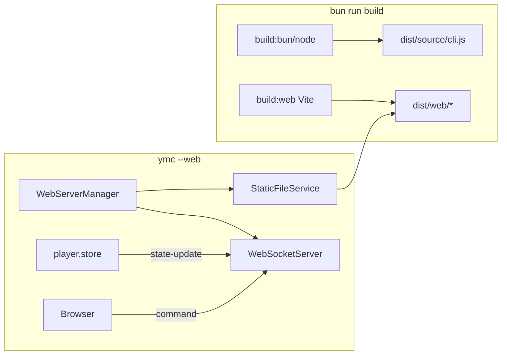

# Web UI Bundle + Phosphor Console Plan

> **For agentic workers:** REQUIRED SUB-SKILL: Use superpowers:subagent-driven-development (recommended) or superpowers:executing-plans to implement this plan task-by-task. Steps use checkbox (`- [ ]`) syntax for tracking.

**Goal:** Make `--web` / `--web-only` always serve a working companion UI from a normal `bun run build` / release, with synced playback controls, responsive layout, and dark/light themes—no separate `build:web` step for users.

**Architecture:** Keep Node `http` + `ws` ([`source/services/web/`](source/services/web/)) and Vite SPA in [`web/`](web/). Fold web build into the main `build` pipeline so assets land in `dist/web/`. Fix static path resolution for the single-file CLI bundle. Pin identical React versions to kill error #527. Rebuild the SPA shell to the **Phosphor Console** design (cyan/amber, Syne + IBM Plex, three-column desktop / dock mobile) while reusing existing WebSocket command/state protocol.

**Tech Stack:** Bun workspaces, Vite 8, React 19.2.8 + react-dom 19.2.8, Zustand, `ws`, AVA tests, CSS variables.

## Global Constraints

- Root and web React must be the **same exact version** (`19.2.8`); `react` and `react-dom` must match each other
- `bun run build` must produce `dist/web/index.html` without a separate user command
- Static assets resolve correctly from both `source/` (dev) and `dist/source/cli.js` (bundled)
- Do not invent a second player path—web commands go through existing [`WebServerManager.handleCommand`](source/services/web/web-server-manager.ts) and Ink sync via [`player.store.tsx`](source/stores/player.store.tsx)
- Aesthetic: Phosphor Console (no purple gradients, no Inter/Roboto, no emoji-only transport)
- Theme via `html[data-theme="dark"|"light"]`; dark is default
- Chrome “blocking ads” banner is unrelated to our stack (heavy-ad intervention); do not chase it—fix the blank page first

## File map

| File                                                                                       | Responsibility                                   |
| ------------------------------------------------------------------------------------------ | ------------------------------------------------ |
| [`web/package.json`](web/package.json)                                                     | Pin `react`/`react-dom` to `19.2.8`              |
| Root [`package.json`](package.json)                                                        | `build` includes `build:web`; optional overrides |
| [`source/services/web/static-file.service.ts`](source/services/web/static-file.service.ts) | Multi-candidate `dist/web` resolution            |
| [`scripts/release.ps1`](scripts/release.ps1)                                               | Ensure web assets built (inherits from `build`)  |
| [`scripts/build-cli.ts`](scripts/build-cli.ts)                                             | After compile, copy `dist/web` beside the binary |
| [`web/src/styles/tokens.css`](web/src/styles/tokens.css)                                   | Phosphor tokens + fonts                          |
| [`web/src/styles/layout.css`](web/src/styles/layout.css)                                   | Responsive shell breakpoints                     |
| [`web/src/components/shell/*`](web/src/components/shell/)                                  | AppShell, TopBar, Nav, Stage, Queue, Dock        |
| [`web/src/App.tsx`](web/src/App.tsx)                                                       | Wire shell + existing WS hooks                   |
| [`tests/web-static-path.test.js`](tests/web-static-path.test.js)                           | Path resolution + “built” detection              |
| [`README.md`](README.md) / [`AGENTS.md`](AGENTS.md)                                        | Document `--web` as zero-extra-step              |



---

### Task 1: Pin React versions (blank-page fix)

**Files:**

- Modify: [`web/package.json`](web/package.json)
- Modify: root [`package.json`](package.json) (optional `overrides` for `react` / `react-dom`)
- Regenerate: `bun.lock`

**Interfaces:** Unchanged. Produces matching `react@19.2.8` + `react-dom@19.2.8` in the Vite bundle.

- [ ] Set web deps to exact aligned versions:

```json
"react": "19.2.8",
"react-dom": "19.2.8"
```

- [ ] Add root overrides so the workspace cannot hoist a split pair:

```json
"overrides": {
  "minimatch": "^10.2.1",
  "react": "19.2.8",
  "react-dom": "19.2.8"
}
```

- [ ] Run `bun install` then `bun run build:web`
- [ ] Confirm `dist/web/assets/index-*.js` does not throw #527 when served (open via Vite preview or CLI `--web`)
- [ ] Commit: `fix(web): align react and react-dom to 19.2.8`

---

### Task 2: Always build web + fix static path resolution

**Files:**

- Modify: [`package.json`](package.json) scripts
- Modify: [`source/services/web/static-file.service.ts`](source/services/web/static-file.service.ts)
- Modify: [`scripts/build-cli.ts`](scripts/build-cli.ts) (copy `dist/web` next to compiled binary)
- Create: [`tests/web-static-path.test.js`](tests/web-static-path.test.js)
- Export helper from static-file service for testability: `resolveWebDistDir(fromFileUrl: string, cwd: string): string`

**Chosen resolution algorithm** (replace the broken 4-level `isDist` math):

```typescript
export function resolveWebDistDir(moduleUrl: string, cwd: string): string {
	const currentFile = fileURLToPath(moduleUrl);
	const currentDir = dirname(currentFile);
	const candidates = [
		// Bundled CLI: dist/source/cli.js → dist/web
		join(currentDir, '..', 'web'),
		// Unbundled: source/services/web/*.ts → projectRoot/dist/web
		join(currentDir, '..', '..', '..', 'dist', 'web'),
		// Compiled binary sibling: <exeDir>/web
		join(dirname(process.execPath), 'web'),
		// CWD fallback (dev / monorepo)
		join(cwd, 'dist', 'web'),
	];
	for (const dir of candidates) {
		if (existsSync(join(dir, 'index.html'))) return dir;
	}
	return candidates[0]!;
}
```

- [ ] Change root build script to:

```json
"build": "bun run build:bun && bun run build:node && bun run copy:tray-icon && bun run build:web"
```

- [ ] Implement `resolveWebDistDir` + use it in `StaticFileService` constructor
- [ ] Update 503 page copy to: “Web UI missing from this install. Rebuild with `bun run build`.”
- [ ] In `build-cli.ts`, after successful compile, recursively copy `dist/web` → `dirname(outfile)/web`
- [ ] AVA test: given fake trees, assert candidate selection; with missing index, `isWebUiBuilt()` is false
- [ ] Verify: `bun run build` creates `dist/web/index.html`; `bun run start -- --web-only` serves HTML 200 (not 503)
- [ ] Commit: `fix(web): ship dist/web with build and resolve static path`

---

### Task 3: Phosphor tokens, fonts, theme hook

**Files:**

- Create: [`web/src/styles/tokens.css`](web/src/styles/tokens.css)
- Modify: [`web/src/styles/globals.css`](web/src/styles/globals.css)
- Modify: [`web/index.html`](web/index.html) (Google Fonts: Syne, IBM Plex Sans, IBM Plex Mono)
- Modify: [`web/src/hooks/useTheme.ts`](web/src/hooks/useTheme.ts) → set `document.documentElement.dataset.theme`

**Tokens (dark default):** `--bg-void #07090c`, `--signal #2ee6d6`, `--amber #e8b339`, `--fg #e6eef6`, plus light theme overrides under `[data-theme="light"]`. Full token block from UI design handoff (Phosphor Console).

- [ ] Replace blue/purple `:root` vars in `globals.css` with imports of `tokens.css`
- [ ] Persist theme in `localStorage` key `ymc-theme`; default `dark`
- [ ] Commit: `style(web): add Phosphor Console design tokens`

---

### Task 4: Responsive shell + player controls UI

**Files:**

- Create: `web/src/components/shell/AppShell.tsx`, `TopBar.tsx`, `NavRail.tsx`, `Stage.tsx`, `QueuePanel.tsx`, `MobileDock.tsx`, `MobileTabBar.tsx`
- Create: `web/src/components/player/Transport.tsx`, `NowPlaying.tsx` (SVG icons via lucide-react direct imports—not barrel if avoidable, or keep lucide with Vite optimize)
- Modify: [`PlayerControls.tsx`](web/src/components/PlayerControls.tsx), [`ProgressBar.tsx`](web/src/components/ProgressBar.tsx), [`QueueList.tsx`](web/src/components/QueueList.tsx), [`NavigationBar.tsx`](web/src/components/NavigationBar.tsx) — either refactor into shell pieces or thin wrappers
- Modify: [`web/src/App.tsx`](web/src/App.tsx)
- Create: [`web/src/styles/layout.css`](web/src/styles/layout.css)

**Layout:**

- Desktop ≥1024px: TopBar + Nav 220px | Stage flex | Queue 300px
- Tablet 768–1023: chip nav, stage + queue
- Mobile &lt;768: artwork stage + fixed Transport dock + tab bar (Player / Search / Queue / Settings); sheets for non-player views

**Behavior (keep protocol):**

- Reuse `useWebSocket`, `usePlayerStore`, `sendCommand` for play/pause/prev/next/seek/volume/shuffle/repeat/autoplay/queue select/remove/search
- Sync pip: connected = solid `--ok`, connecting pulse, disconnected `--danger`
- `prefers-reduced-motion`: opacity-only transitions
- Transport: `role="group" aria-label="Playback"`; progress as accessible slider; polite live region on track change

- [ ] Implement shell + wire existing store/WS (no protocol changes)
- [ ] Ensure dark/light toggle works and is visible in TopBar
- [ ] Visual check at 375 / 768 / 1280 widths
- [ ] Commit: `feat(web): Phosphor Console responsive companion UI`

---

### Task 5: Docs + verification gate

**Files:**

- Modify: [`README.md`](README.md) — `--web` / `--web-only` usage; note that release builds include UI
- Modify: [`AGENTS.md`](AGENTS.md) — web workspace + `build` includes web
- Modify: [`SUGGESTIONS.md`](SUGGESTIONS.md) — mark web frontend shipped

**Verification (must all pass before done):**

```bash
bun install
bun run build
# assert exists: dist/web/index.html
bunx ava tests/web-static-path.test.js --timeout=60s
bun run typecheck
bun run lint
cd web && bun run typecheck
# Manual: bun run start -- --web-only  → open http://localhost:8080 → player UI loads, no React #527
```

- [ ] Commit: `docs: document bundled web UI with --web`

## Spec coverage (self-check)

| Requirement                        | Task                                                             |
| ---------------------------------- | ---------------------------------------------------------------- |
| Release “Web UI Not Built”         | 2 (build pipeline + path fix)                                    |
| Blank page / React #527            | 1                                                                |
| Always bundled, no extra user step | 2 (`build` includes web; npm `files: ["dist"]` already ships it) |
| Full synced stream + controls      | 4 (existing WS; UI surfaces all commands)                        |
| Responsive UI                      | 4                                                                |
| Dark mode                          | 3 + 4                                                            |
| Distinctive non-slop design        | 3 + 4 (Phosphor Console)                                         |

Also save a copy at `docs/superpowers/plans/2026-07-26-web-ui-bundle-fix.md` during implementation (same content as this plan).
